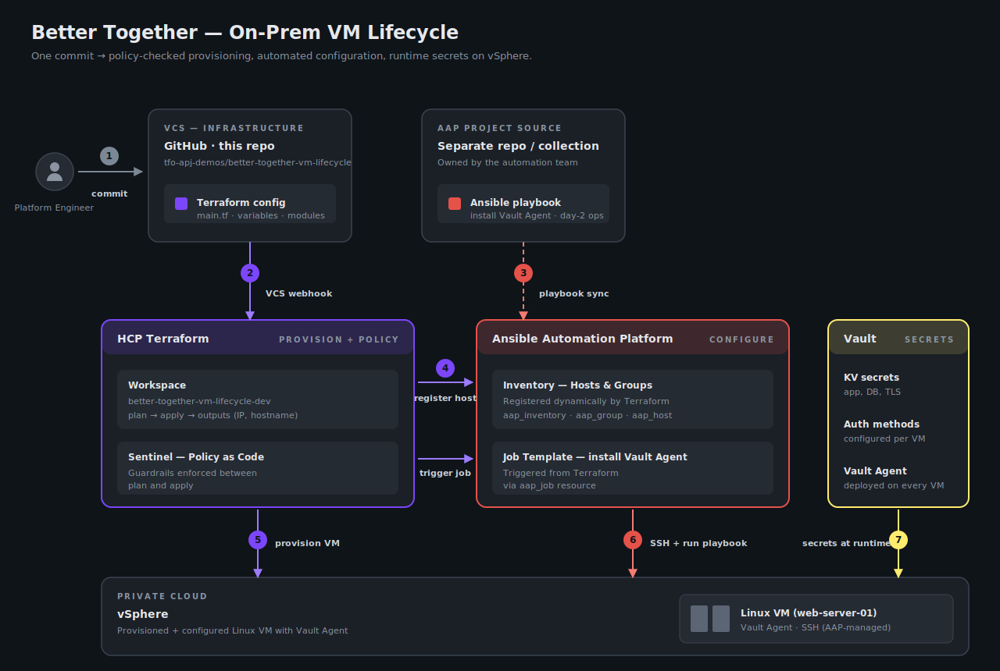

# Better Together: On-Prem VM Lifecycle

A reference pattern showing the **HashiCorp × Red Hat "Better Together"**
integration for on-prem VM lifecycle on vSphere: **Terraform** provisions
the VM, **Ansible Automation Platform (AAP)** configures it, and
**HashiCorp Vault** (via the Vault Agent) supplies its runtime secrets.

The aim is a single, declarative workflow that takes a VM from "doesn't
exist" to "running, configured, and pulling secrets from Vault" — and
back down again — without imperative scripting.

## Architecture



The flow above is what the code in this repo executes end-to-end:

1. **Commit** — An engineer pushes Terraform config to this GitHub repo.
2. **VCS webhook** — The push triggers a plan in the HCP Terraform workspace.
3. **Playbook sync** — Independently, AAP keeps its project synced from a separate source owned by the automation team. This decoupling lets the platform and automation teams iterate on their own cadence.
4. **Register & trigger** — On apply, Terraform creates the AAP inventory entries (`aap_inventory`, `aap_group`, `aap_host`) and triggers jobs via Terraform 1.14 **actions** wired to lifecycle events.
5. **Provision** — Terraform creates the Linux VM in vSphere via the private `single-virtual-machine` module.
6. **Configure** — AAP SSHes into the VM and runs the after-create playbook stack.
7. **Secrets at runtime** — The Vault Agent on the VM authenticates to Vault and pulls runtime secrets — no static credentials in the VM image.

Sentinel sits between plan and apply in HCP Terraform to enforce policy
guardrails before any change reaches vSphere.

## Lifecycle Hooks (Terraform 1.14 Actions)

The workspace exposes two categories of AAP job templates:

| Category | Anchor / firing |
|----------|-----------------|
| Lifecycle-bound | `aap_host.vm_hosts` for `before_create` / `before_update`; `terraform_data.vm_provisioned` for `after_create` / `after_update` |
| Ad-hoc vSphere ops | Declared as `action.aap_job_launch.*` but unbound — fire from the TFC UI on demand |

The pre-VM actions live on `aap_host` rather than on a separate
`terraform_data` so the VM module needs no explicit `depends_on` —
that would force its tag-lookup data sources to defer to apply time and
trip a schema-validation failure in the upstream `virtual-machine/vsphere`
module's `[for tag in module.tags : tag.tag_id]` comprehension.

### `before_create` — before the VM exists

| Action | AAP Job Template | What it does |
|--------|------------------|--------------|
| `action.aap_job_launch.cmdb_change_open` | `pre-cmdb-change-open` | Opens a ServiceNow change record with CAB-ready fields, linked to the TFC run ID |

### `after_create` + `after_update` — idempotent configuration

| Action | AAP Job Template | What it does |
|--------|------------------|--------------|
| `action.aap_job_launch.rhel_register` | `rhel-register` | Registers with Red Hat Subscription Manager |
| `action.aap_job_launch.cis_hardening` | `rhel-cis-hardening` | Applies a CIS L1 / DISA STIG-aligned baseline |
| `action.aap_job_launch.chrony_timesync` | `rhel-chrony-timesync` | Configures chrony against bank stratum-1 NTP |
| `action.aap_job_launch.vault_agent` | `rhel-install-vault-agent` | Installs and configures the Vault Agent |
| `action.aap_job_launch.install_nginx` | `rhel-install-nginx` | Installs and configures Nginx |

### `before_update` — before Terraform mutates the VM

| Action | AAP Job Template | What it does |
|--------|------------------|--------------|
| `action.aap_job_launch.cmdb_change_open` | `pre-cmdb-change-open` | Re-opens / extends the ServiceNow change record |
| `action.aap_job_launch.vsphere_snapshot` | `pre-vsphere-snapshot` | Takes a pre-change vSphere snapshot via the Vault LDAP dynamic role |
| `action.aap_job_launch.lb_pool_drain` | `pre-lb-pool-drain` | Drains the VM from its F5 BIG-IP pool with a grace window |

### `after_update` — additional checks after change applies

| Action | AAP Job Template | What it does |
|--------|------------------|--------------|
| `action.aap_job_launch.post_change_validate` | `rhel-post-change-validate` | TCP / systemd / HTTP / clock-skew checks; fails the action on regression |
| `action.aap_job_launch.lb_pool_reenable` | `post-lb-pool-reenable` | Re-adds the VM to F5, waits for monitor:up, triggers a Qualys rescan |

### Ad-hoc vSphere ops (no lifecycle binding)

These are declared as actions so they're invocable from the TFC UI, but
not wired into any `action_trigger`. Each one reads a fresh leased
vCenter service account from Vault's LDAP secrets engine
(`ldap/creds/vsphere_access`) for the duration of the job.

| Action | AAP Job Template | What it does |
|--------|------------------|--------------|
| `action.aap_job_launch.vsphere_power_off` | `vsphere-power-off` | Graceful guest shutdown via VMware Tools |
| `action.aap_job_launch.vsphere_power_on` | `vsphere-power-on` | Power on |
| `action.aap_job_launch.vsphere_guest_reboot` | `vsphere-guest-reboot` | Reboot guest OS via VMware Tools |
| `action.aap_job_launch.vsphere_revert_snapshot` | `vsphere-revert-snapshot` | Revert to a named snapshot (default: most recently created) |
| `action.aap_job_launch.vsphere_remove_all_snapshots` | `vsphere-remove-all-snapshots` | Remove all snapshots — vSphere consolidates the disk chain |

> **Note**: `before_destroy` / `after_destroy` actions aren't yet in
> Terraform 1.14 — when they land, the natural extensions are
> `cmdb-close-change`, `backup-archive`, and `cmdb-retire-ci`.

## Playbook source

All playbooks and roles live in
[hashi-demo-lab/ansible-rhel-post-deploy](https://github.com/hashi-demo-lab/ansible-rhel-post-deploy)
under `playbooks/` and `roles/`. AAP project ID `57` in the demo
controller (`ansible-rhel-post-deploy`) keeps it synced on `main`.

The ansible repo also contains additional playbooks that aren't wired
into this workspace (`rhel-splunk-uf-install`, `rhel-crowdstrike-install`,
`rhel-qualys-install`, `rhel-ad-domain-join`, `pre-ipam-reserve`) — they
remain as ad-hoc job templates in AAP for other workspaces or manual
launch.

## What gets passed to AAP per host

The `aap_host` resource encodes the variables every role needs:

```hcl
{
  os_type, backup_policy, storage_profile, tier, cert_service_type,
  site, env, security_profile, ad_domain,
  tfc_workspace_name, tfc_run_id,
  ansible_host  # FQDN — DNS resolves to the VM's IP once provisioned
}
```

Secrets are never in here — every role reads them at runtime from
Vault. Static-account paths use `community.hashi_vault.vault_kv2_get`
(KV v2). vCenter ops use `community.hashi_vault.vault_read` against the
LDAP dynamic role at `ldap/creds/vsphere_access`, which leases a fresh
AD account scoped through the `g_vsphere_access` group for each job.
